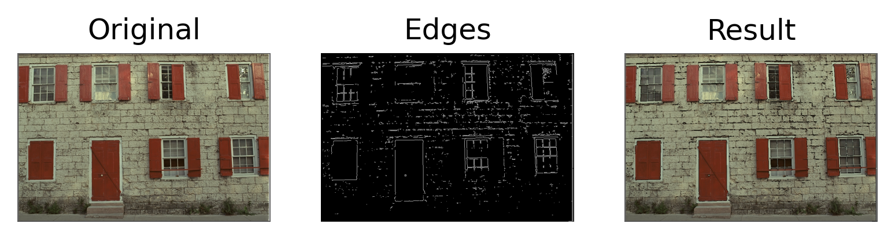
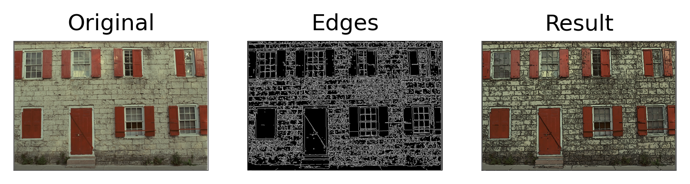
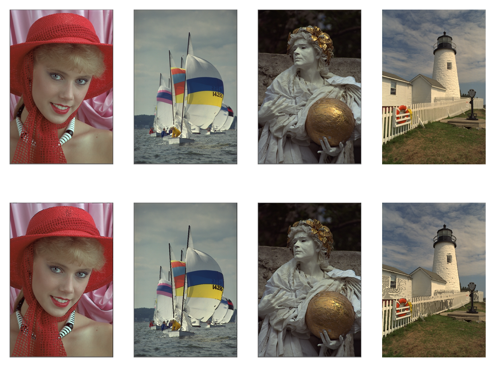
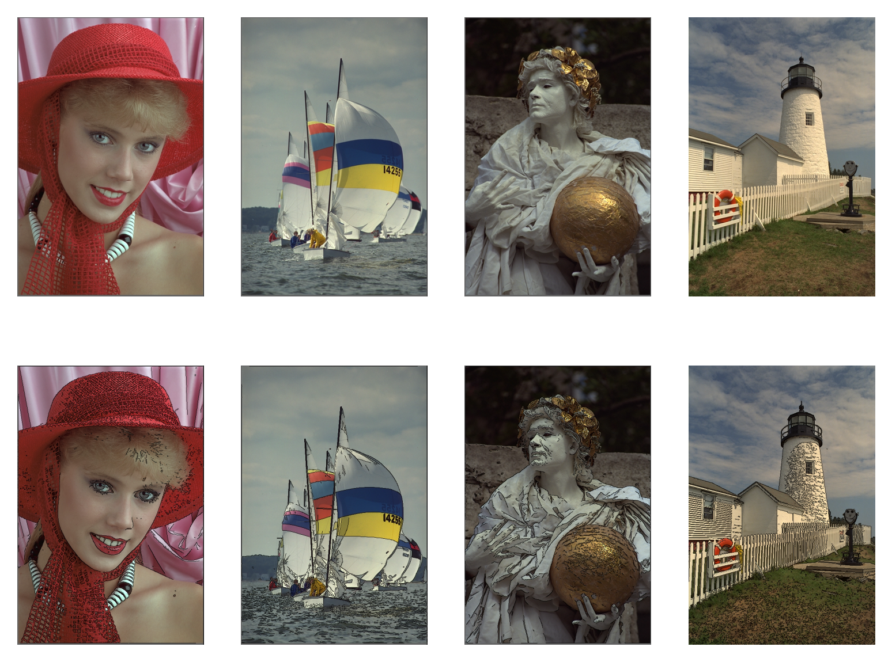

# Image-edge-enhancement-with-OpenCV
En este repositorio se implementa un tecnica sencilla para resaltar los bordes en imagenes. Para ello, se utilza el metodo de Canny para detectar bordes, el cual esta implementado en OpenCV. Posteriormente, se realiza una transformacion a la imagen original con la informacion de los borde. De esta manera se resaltan ciertas regiones de la imagen para obtener resultados mas esteticos.

## Descripcion del metodo
El metodo consta de dos etapas, en la primera, se detectan los bordes de la imagen de entrada usando el metodo Canny implementado en la librearia de OpenCV. Cabe mencionar que el metodo de Canny utiliza un para de parametros para el calculo de bordes: $minV$ y $maxV$. El metodo sera mas sencible dependiendo del valor asignado a cada parametro. Por defecto $minV=400$ y $maxV=450$. La deteccion de bordes es menos sensible al incrementar el valor de estos parametros, y mas sencible en el caso contrario. Una vez que se han detectado los bordes de la imagen de entrada, se resta la intensidades de los pixeles de los bordes a la imagen original, de esta manera conseguimos resaltar los bordes en la imagen. A continuacion se muestra un ejemplo del funcionamiento del metodo:



## Instalacion
Clona o descarga este repositorio:
```bash
git clone git@github.com:daniel-lima-lopez/Image-edge-enhancement-with-OpenCV.git
```

## Ejemplo
El metodo se instancia indicando el directorio de la imagen con la cual se va a trabajar:
```python
from EdgeEnhancement import EdgeEnhancer
test = EdgeEnhancer('path')
```
El costructor de la clase acepta distintos valores para detectar bordes:
```python
test = EdgeEnhancer('path', minVAL=100, maxVAL=150)
```
Una vez que se ha instanciado un objteto de la clase EdgeEnhancer, podemos usar el metodo ``plot()`` para observar los bordes detectados y el resultado final:
```
test.plot()
```

Para guardar el resultado final podemos usar el metodo ```imwrite.()```:
```
test.plot()
```
A continuacion se muestran algunos resultados obtenidos con la configuracion por defecto (minVAL=400 y maxVAL=450):

Por otro lado, note que al modificar el umbral de deteccion de bordes obtenemos resultados con bordes mas detallados:


